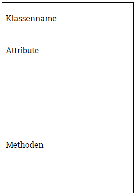

# Klassendiagramm

...zur Darstellung von Klassen

- Modellierungssprache
- Teile (u.a.)
  - Klassendiagramm
  - Sequenzdiagramm
  - Aktivitätsdiagramm

## Basis-Schema

| In Schema | Erläuterung |
|-----------|-------------|
| Klassenname | Name |
| Attribute | Liste der Attribute (= Eigenschaften), können auch leer sein, je nach Modifikator nur von Klasse selbst zugreifbar (private) oder von allen externen (public) |
| Methoden | Liste der Methoden (= ausführbare Aktionen) |

## Umsetzung Klassendiagramm in Java

- Attribute
- Methoden

- Übersetzung in Java
