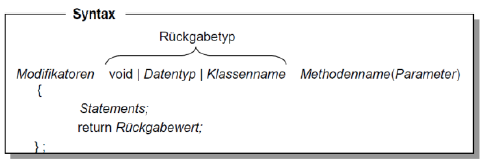
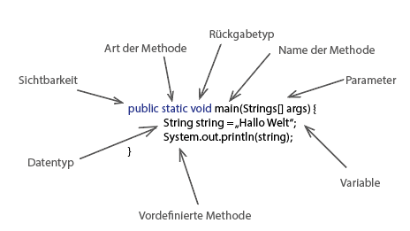

# Methoden

...definieren Funktionalität der jeweiligen Klasse und setzen deren Verhalten um.

- Vielzahl von sequentiell ausführbaren Kommandos, die spezifische Operationen (mit Objektdaten) ausführen
- minimal program must contain at least one class that must include at least one method/ function to get the program running (= main method)
- body of a method consists of commands <=> method is group of commands

## Arten

| Methodenart    | Erläuterung                                          |
|----------------|------------------------------------------------------|
| Klassenmethode | benötigt kein erzeugtes Objekt, um genutzt zu werden |
| Objektmethode  | benötigt erzeugtes Objekt, um genutzt zu werden      |

-> Objekt- und Klassenmethoden kommen meist gleichzeitig vor


## Parameters

...passed arguments.

- we use parentheses to pass arguments to the method (also called parameter)
  -> depending on the value of the arguments, the same method can execute different action
- pass by value -> primitve types are passed to methods by value (copy is created)
- pass by reference -> objects as parameter are passed by reference

## Rückgabe

- Methoden, die Wert zurückgeben, nutzen Keyword "return"
  -> "return" stoppt Methode vom ablaufen
- save return of method in variable:
  ```java
  int num1 = getNum1();
  ```
  -> pay attention to datatype that method returns
  -> if you want to save return in different datatype, use type conversion

Bsp:
```java
//Method that multiplies two numbers
public static int multiply(int num1, int num2) {
  return num1 * num2;
}

/*
* returns int,
* two input parameters (of datatype int),
* perform multiplication of num1 and num2
* return solution of multiplication
*/

//Call method and save solution in variable
int a = myMethod(5, 4);
```

## Syntax



## Beispielmethode



| Schlüsselwort | Aussage über     | Aussage                                                          |
|---------------|------------------|------------------------------------------------------------------|
| public        | Sichtbarkeit     | "Jeder darf mich sehen"                                          |
| static        | Methodenart      | "Ich bin eine Klassenmethode"                                    |
| void          | Rückgabetyp      | "Ich gebe nichts zurück"                                         |
| main          | Name der Methode | "Ich heiße main"                                                 |
| args          | Parameter        | "Du kannst mir etwas in Form eines Zeichenkettenarrays mitgeben" |

## Call Method

- method call must have the same number of arguments as there are parameters in the method
- parameters must be passed in the right order

## Method Overloading

...overload methods - methods with the same name but different parameters

## Zusammenfassung

- definieren Funktionalität der jeweiligen Klasse und der daraus erzeugten Objekte
- Syntax: [Modifikator] [Rückgabetyp] [Methodenname](Parameter) { }
- method body consists of commands/statements
